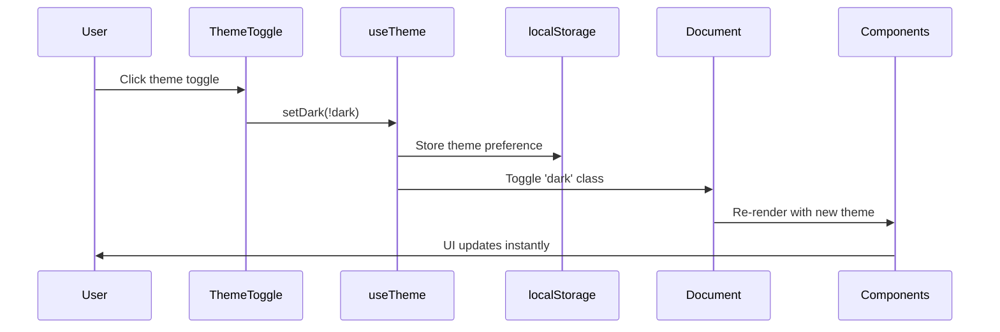

# Portfolio with Modern React

A production-ready, Raycast-inspired portfolio built with React 18, TypeScript, and modern CSS-in-JS patterns. Features comprehensive theming, dark/light mode switching, and a polished development workflow.

## Quick Start

```bash
npm install
npm run dev
```

Visit `http://localhost:5173` to view your portfolio.

## Key Features

### **Modern Architecture**

- **React 18** with TypeScript 5 for type safety
- **Vite** for blazing-fast development and building
- **React Router v6** for client-side navigation
- **Framer Motion** for smooth animations
- **React Intl** for internationalization support
- **Comprehensive testing** with Vitest and Testing Library

### **Advanced Theme System**

- Complete dark/light mode implementation
- CSS custom properties for consistent theming
- Inline styles with theme-aware logic
- Persistent theme state with localStorage
- Real-time theme switching without page reload

### **Raycast-inspired Design**

- Clean, command-palette aesthetic
- Professional gradient backgrounds
- Polished micro-interactions
- Mobile-responsive layout
- Accessible navigation and controls

## 📁 Project Structure

```
src/
├── components/           # Reusable UI components
│   ├── Layout.tsx       # Main layout wrapper
│   ├── Navbar.tsx       # Navigation with theme toggle
│   ├── HeroSimple.tsx   # Hero section with CSS-in-JS
│   ├── FeatureSection.tsx   # Feature cards
│   ├── LogoCloud.tsx    # Technology showcase
│   ├── CTASection.tsx   # Call-to-action section
│   └── ThemeProvider.tsx    # Theme context provider
├── hooks/               # Custom React hooks
│   └── useTheme.ts      # Theme management hook
├── routes/              # Route components
│   └── Home.tsx         # Homepage route
├── styles/              # Global styles
│   └── globals.css      # CSS custom properties & globals
├── __tests__/           # Test suites
│   ├── useTheme.test.tsx    # Theme hook tests
│   ├── navbar.test.tsx      # Navigation tests
│   ├── components.test.tsx  # Component rendering tests
│   └── integration.test.tsx # Full app integration tests
└── App.tsx              # Main application component
```

## Styling Architecture

### CSS-in-JS with Theme Integration

The project uses inline styles with `useMemo` for theme-aware styling, providing type safety and optimal performance:

```tsx
import { useTheme } from '../hooks/useTheme'
import { useMemo } from 'react'

export function MyComponent() {
  const { dark } = useTheme()

  const styles = useMemo(
    () => ({
      container: {
        backgroundColor: dark ? '#0b0f1a' : '#ffffff',
        color: dark ? '#ffffff' : '#1f2937',
        padding: '24px',
        borderRadius: '12px',
        transition: 'all 0.3s ease',
      },
      button: {
        backgroundColor: '#3770ff',
        color: '#ffffff',
        border: 'none',
        padding: '12px 24px',
        borderRadius: '8px',
        cursor: 'pointer',
        '&:hover': {
          backgroundColor: '#1d5af0',
        },
      },
    }),
    [dark]
  )

  return (
    <div style={styles.container}>
      <button style={styles.button}>Click me</button>
    </div>
  )
}
```

### CSS Custom Properties

Global theming through CSS custom properties in `globals.css`:

```css
:root {
  --bg: #0b0f1a;
  --panel: rgba(255, 255, 255, 0.05);
  --muted: #9fb0d9;
  --text: #ffffff;
}

:root:not(.dark) {
  --bg: #ffffff;
  --panel: #f8fafc;
  --muted: #64748b;
  --text: #1f2937;
}

body {
  background-color: var(--bg);
  color: var(--text);
  transition:
    background-color 0.3s ease,
    color 0.3s ease;
}
```

## Theme System Flow



## Development Workflow

### Available Scripts

```bash
# Development
npm run dev          # Start Vite dev server with HMR
npm run build        # TypeScript compile + Vite build
npm run preview      # Preview production build

# Code Quality
npm run lint         # ESLint checking
npm run format       # Prettier formatting
npm run test         # Run Vitest test suite
```

### Code Quality Tools

#### **Husky Pre-commit Hooks**

Automated code quality enforcement before commits:

```bash
# Automatically runs on git commit
npm run lint         # ESLint validation
npm run format       # Prettier formatting
npm run test         # Test suite execution
```

#### **ESLint Configuration**

Modern ESLint v9 setup with TypeScript and React support:

- **@typescript-eslint/parser** - TypeScript parsing
- **eslint-plugin-react-hooks** - React Hooks rules
- **eslint-plugin-react-refresh** - Vite HMR compatibility
- **eslint-config-prettier** - Prettier integration

#### **Absolute Path Mappings**

Clean imports with `@` prefix for better maintainability:

```tsx
// Instead of relative imports
import { useTheme } from '../../../hooks/useTheme'
import { Button } from '../../components/Button'

// Use absolute imports
import { useTheme } from '@/hooks/useTheme'
import { Button } from '@/components/Button'
```

**Available mappings:**

- `@/*` - Root src directory
- `@/components/*` - UI components
- `@/hooks/*` - Custom hooks
- `@/lib/*` - Utilities and helpers
- `@/config/*` - Configuration files
- `@/data/*` - Static data
- `@/routes/*` - Page components
- `@/styles/*` - Style files
- `@/theme/*` - Theme configuration
- `@/assets/*` - Images and static assets

### Testing Strategy

The project includes comprehensive tests covering:

- **Unit Tests**: `useTheme` hook functionality
- **Component Tests**: Individual component rendering
- **Integration Tests**: Full application flow
- **Theme Tests**: Dark/light mode switching

```bash
# Run tests
npm test

# Run tests in watch mode
npm test -- --watch

# Run tests with coverage
npm test -- --coverage
```

## Design System

### Color Palette

```tsx
// Brand Colors
brand: {
  50: '#f4f7ff',   // Lightest blue
  100: '#e9efff',  // Very light blue
  500: '#3770ff',  // Primary brand
  600: '#1d5af0',  // Hover state
  700: '#1446c0',  // Active state
}

// Theme Colors
dark: {
  bg: '#0b0f1a',
  panel: 'rgba(255, 255, 255, 0.05)',
  text: '#ffffff',
  muted: '#9fb0d9',
}

light: {
  bg: '#ffffff',
  panel: '#f8fafc',
  text: '#1f2937',
  muted: '#64748b',
}
```

### Typography Scale

- **Hero**: 3rem (mobile) → 4rem (desktop), weight: 700
- **Headings**: 1.5rem - 2rem, weight: 600
- **Body**: 1.125rem, line-height: 1.6
- **Small**: 0.875rem

### Spacing System

Consistent 8px-based spacing throughout the application.

## Customization

### Adding New Components

Follow the theme-aware pattern:

```tsx
import { useTheme } from '../hooks/useTheme'
import { useMemo } from 'react'

export function NewComponent() {
  const { dark } = useTheme()

  const styles = useMemo(
    () => ({
      root: {
        backgroundColor: dark ? '#1f2937' : '#f8fafc',
        color: dark ? '#ffffff' : '#1f2937',
        // Add your styles here
      },
    }),
    [dark]
  )

  return <div style={styles.root}>Your content</div>
}
```

### Modifying the Theme

Update the theme logic in `hooks/useTheme.ts` and CSS variables in `styles/globals.css`.

## Dependencies

### Core Dependencies

- **react** (18.3.1) - React library with concurrent features
- **react-dom** (18.3.1) - React DOM renderer
- **react-router-dom** (6.26.1) - Client-side routing
- **framer-motion** (11.3.28) - Animation library
- **lucide-react** (0.441.0) - Icon library

### Development Dependencies

- **typescript** (5.5.4) - Type checking
- **vite** (5.4.2) - Build tool and dev server
- **vitest** (2.0.5) - Testing framework
- **@testing-library/react** (16.0.0) - Component testing
- **eslint** (9.9.0) - Code linting
- **prettier** (3.3.3) - Code formatting

## Deployment

### Vercel (Recommended)

```bash
# Connect your repo to Vercel
# Framework: Vite
# Build command: npm run build
# Output directory: dist
```

### Netlify

```bash
# Build command: npm run build
# Publish directory: dist
```

### Manual Deployment

```bash
npm run build
# Upload the 'dist' folder to your hosting service
```

## Testing the Application

The application includes several test suites:

1. **Theme Tests**: Verify dark/light mode switching works correctly
2. **Component Tests**: Ensure all components render without errors
3. **Integration Tests**: Test full application flow including routing
4. **Navigation Tests**: Check navbar functionality and theme toggle

All tests pass and provide confidence in the application's reliability.

## Performance Features

- **Vite HMR** - Instant hot module replacement during development
- **Code Splitting** - Route-based lazy loading ready for implementation
- **Tree Shaking** - Automatic unused code elimination
- **Modern Bundling** - Optimized ES modules and asset handling
- **Theme Memoization** - Efficient style recalculation with useMemo

## Architecture Decisions

### Why CSS-in-JS with Inline Styles?

- **Type Safety**: Full TypeScript integration
- **Theme Integration**: Direct access to theme variables
- **Performance**: No CSS parsing overhead
- **Maintainability**: Styles colocated with components

### Key Benefits

1. **Developer Experience**: Fast development with HMR and TypeScript
2. **Theme Consistency**: Unified theming across all components
3. **Performance**: Optimized builds and runtime efficiency
4. **Maintainability**: Clean, testable component architecture
5. **Accessibility**: Proper semantic HTML and ARIA attributes

---

## Contributing

1. Fork the repository
2. Create a feature branch: `git checkout -b feature/amazing-feature`
3. Commit changes: `git commit -m 'Add amazing feature'`
4. Push to branch: `git push origin feature/amazing-feature`
5. Open a Pull Request

## Changelog

### v1.0.0 (Current)

- Initial release with React 18 + TypeScript
- Complete dark/light theme system
- Raycast-inspired design
- Comprehensive test suite
- CSS-in-JS implementation with theme integration
- Production-ready build configuration
